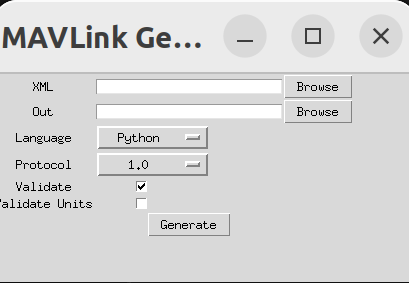

指路：

战队git  [ControlFamily/mavlink - mavlink - 你好，世界](http://10.249.19.53:3000/ControlFamily/mavlink)

XieYang靴长的GitHub：[MirTITH/WTR-Mavlink-Library: 移植到 stm32 平台的 mavlink (github.com)](https://github.com/MirTITH/WTR-Mavlink-Library/tree/main)

## Quick start

### Generate C headers

To install the minimal MAVLink environment on Ubuntu LTS 20.04 or 22.04, enter the following on a terminal:（Windows也一样)

```bash
# Dependencies
sudo apt install python3-pip

# Clone mavlink into the directory of your choice
git clone https://github.com/mavlink/mavlink.git --recursive
cd mavlink

python3 -m pip install -r pymavlink/requirements.txt
```

然后输入 `python mavgenerate.py`

就可以见到这个小小的图形化窗口。



把language换成C，XML传入自己写好的文件，Out填入要用来放置头文件的文件夹（一般与XML放在一起)，然后generate即可

不过实际用的时候一般只需要在[老登祖传代码](http://10.249.19.53:3000/CYT/R1_Upper/src/branch/main/UserCode/Lib/Mavlink)
里面找到wtr_mavlink.c和.h,把这个.h文件包含起来就够了

https://www.runoob.com/xml/xml-elements.html
